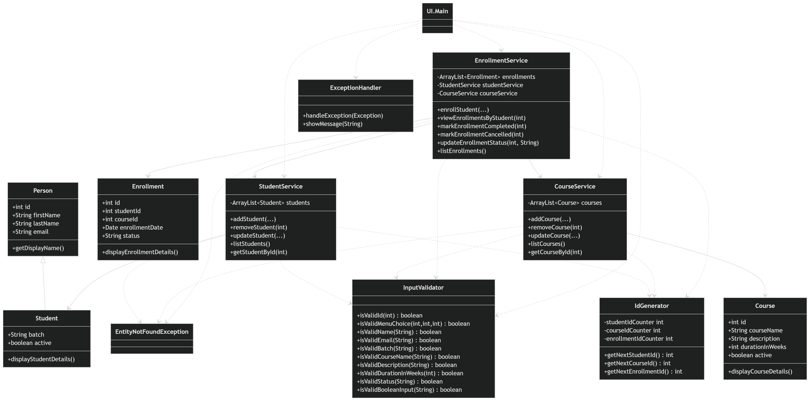

# Student Course Enrollment Management System

## Overview
This is a console-based Java application built using Object-Oriented Programming principles to manage:

- Students
- Courses
- Enrollments

The system allows users to add and manage students and courses, enroll students into courses, view enrollments, and update enrollment status.

---

## Features

### Student Management
- Add student
- List students
- Update student
- Remove student

### Course Management
- Add course
- List courses
- Update course
- Remove course

### Enrollment Management
- Enroll a student in a course
- View enrollments for a student
- Mark enrollment as completed
- Mark enrollment as cancelled

### Validation and Exception Handling
- Handles invalid menu choices
- Handles invalid numeric input
- Throws custom exception when a student, course, or enrollment is not found
- Uses input validation before processing user data

---

## Tech Stack
- Java
- OOP
- Collections (`ArrayList`)
- Exception Handling
- Console-based UI

---

## Project Structure

```text
src
├── Entity
│   ├── Person.java
│   ├── Student.java
│   ├── Course.java
│   └── Enrollment.java
│
├── Service
│   ├── StudentService.java
│   ├── CourseService.java
│   └── EnrollmentService.java
│
├── Util
│   ├── InputValidator.java
│   ├── ExceptionHandler.java
│   └── IdGenerator.java
│
├── Exception
│   └── EntityNotFoundException.java
│
└── UI
    └── Main.java
```

---

## Class Diagram

